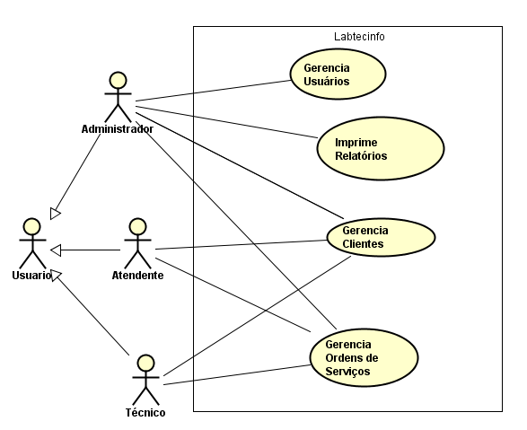
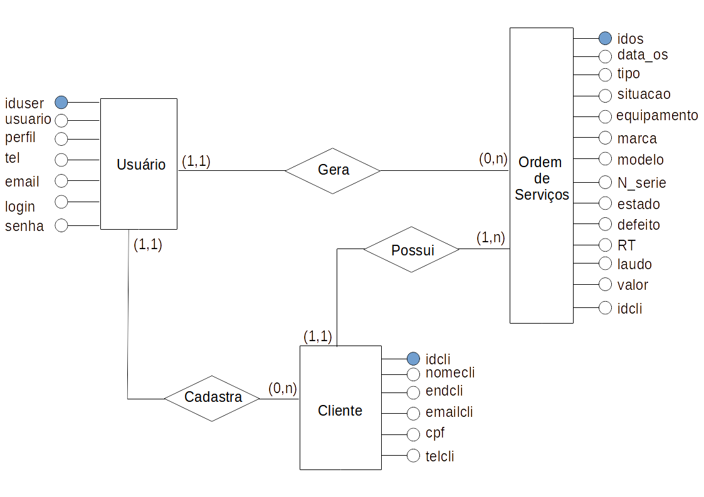
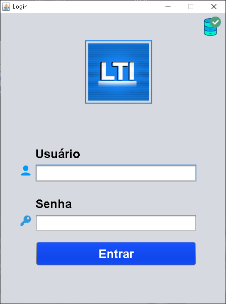
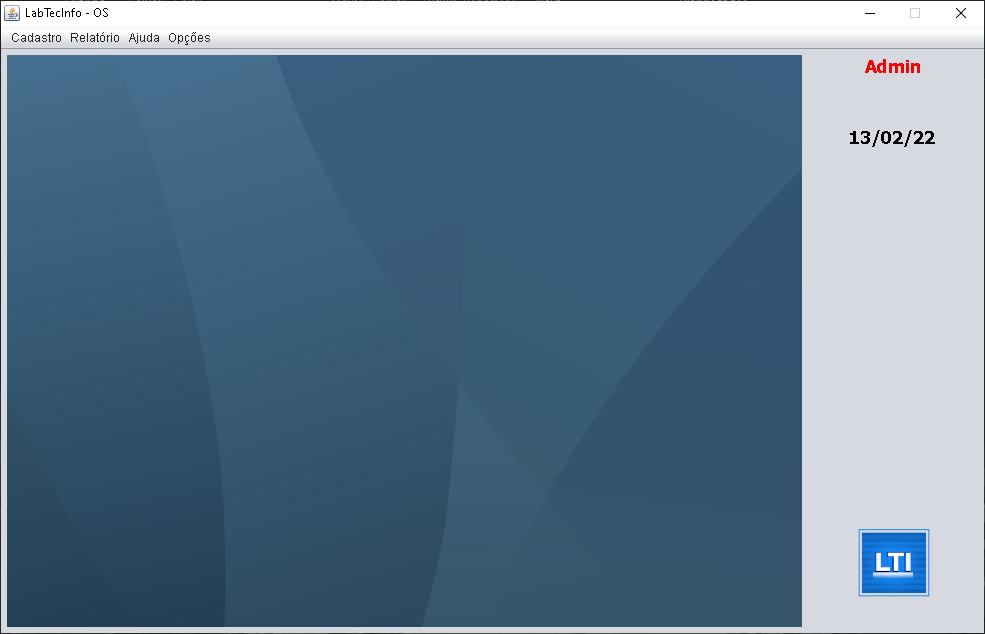
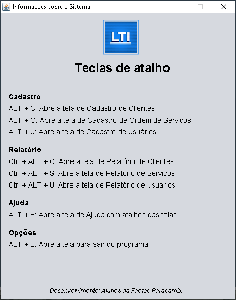
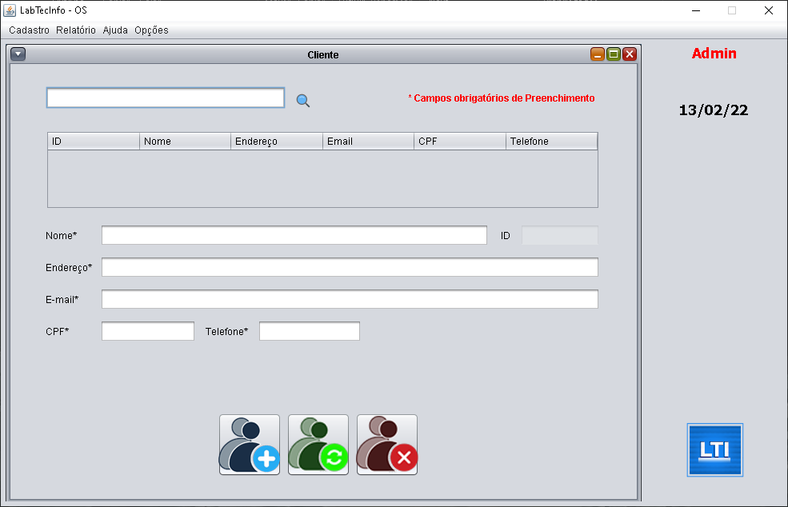
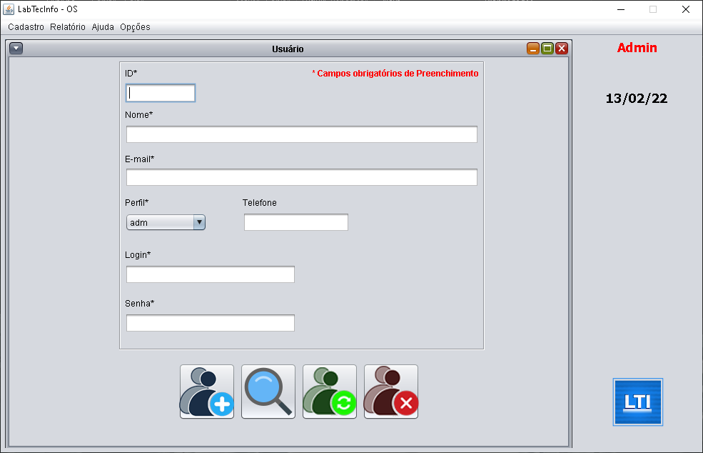
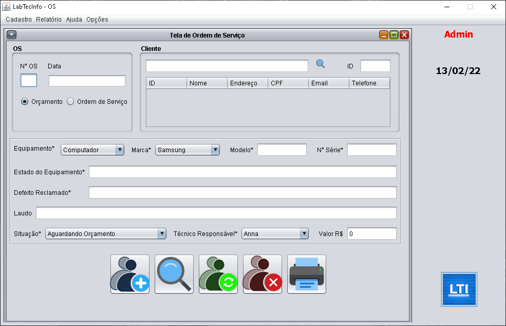
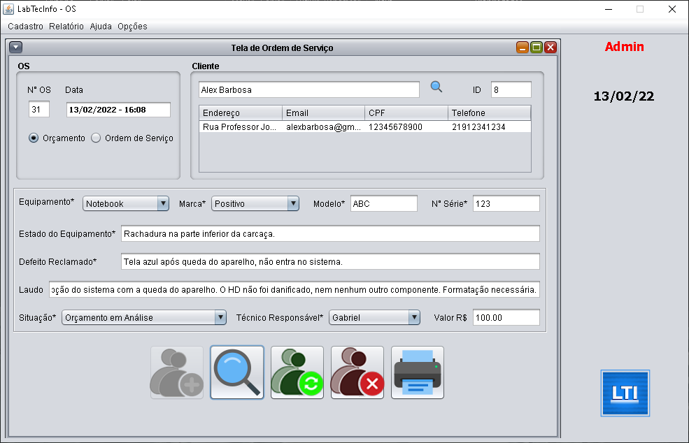
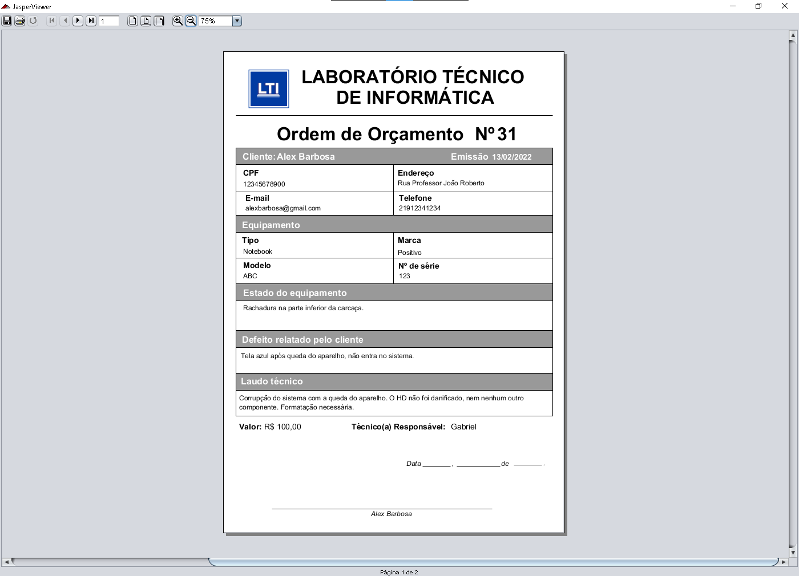

# Instituição

:school_satchel: [Faetec - RJ](http://www.faetec.rj.gov.br/)

:school: [ETE Paracambi - RJ](https://www.eteparacambi.com.br/)

:cityscape: [Prefeitura de Paracambi](https://paracambi.rj.gov.br/)

# Projeto

## :book: Introdução

O presente projeto visa o desenvolvimento de um Sistema de Ordem de Serviços nomeado "LABTECINFO". O sistema terá finalidade de cadastrar e gerenciar ordens de serviços de uma empresa de manutenção de equipamentos de informática, e para isso, nós contamos com a presença de um profissional qualificado em SCRUM, que busca compreender as necessidades do cliente e como trabalhar para que a tecnologia da informação e comunicação empregada da melhor forma e assim trazer benefícios para a empresa.

O sistema visa facilitar o desenvolvimento do dia-a-dia de toda a equipe sendo ela atendimento, laboratório, e gerência. O projeto visa criar um sistema no qual qualquer empresa de manutenção poderá utilizar, apropriando-se de todos os campos existentes no projeto, que será desenvolvido para o sistema operacional Windows, podendo ser compatível com outros sistemas operacionais, como o Linux.

## :man_technologist: Componentes do grupo

### Alunos

* Anna C. S. Camacho
* **Gabriel G. M. Barros** *(dono deste repositório)*
* Igor de O. Silva
* Larissa H. Justino
* Marcio L. da S. Oliveira
* Matheus A. Flores
* Weverton C. Fabre

### Professor

* Sergio C. da Silva

## :dart: Divisão das tarefas

* **Anna Carla**, **Larissa**, **Matheus** e **Weverton**:
  * Documentação do projeto;
  * Mini mundo;
  * Diagrama de Caso de Uso;
  * DER;
  * Testes.

* **Márcio** e **Gabriel**: 
  * Programação do código em linguagem orientada a objetos (Java);
  * Programação do banco de dados relacional (MySQL) e conexão do sistema com o banco de dados relacional;
  * Testes.

* **Gabriel** e **Igor**:
  * Desenvolvimento das telas e design da concepção visual do sistema.

## :hammer_and_wrench: Tecnologias utilizadas

### Desenvolvimento e GUI

* IDE Netbeans
* Java Swing

### Linguagem de Programação

* Java (JDK 8)

### Banco de Dados

* Wampserver64
* MySQL Workbench

### Edição de Imagens

* GIMP
* Adobe Photoshop

### Relatórios

* iReport Designer (2014)

## :framed_picture: Imagens

### Diagramas

Caso de uso

Diagrama Entidade-Relacionamento

### Telas

Tela de Login

Tela Principal

Tela Sobre

Tela Cliente

Tela Usuário

Tela OS (Ordem de Serviço)

Tela OS preenchida

Impressão de OS

### Fim das imagens

Se quiser ver as imagens com mais qualidade, peço que clique nas mesmas. Por hora, não vou postar tantas imagens para não "entulhar" o repositório, mas no geral, todo o trabalho feito está nas imagens.

## :pencil: Considerações

:mask: Devido à pandemia de *COVID-19*, o projeto teve que ser feito totalmente à distancia, pois até então, as aulas presenciais estavam suspensas. Trabalhamos em equipe, marcando reuniões em programas como o Meet e o Zoom para discutir sobre todo o desenvolvimento do projeto. Muitas coisas tiveram que ser repensadas, tivemos que nos adaptar ao longo do percurso para concluir esse projeto a tempo.

:no_entry: Nem todos os arquivos serão compartilhados, pois este projeto foi desenvolvimento por diversos alunos, com a participação do professor responsável. Este projeto está hospedado aqui apenas para caráter demonstrativo.

:question: Qualquer dúvida é só falar comigo pelo meu LinkedIn fixado no meu perfil! :smile:
